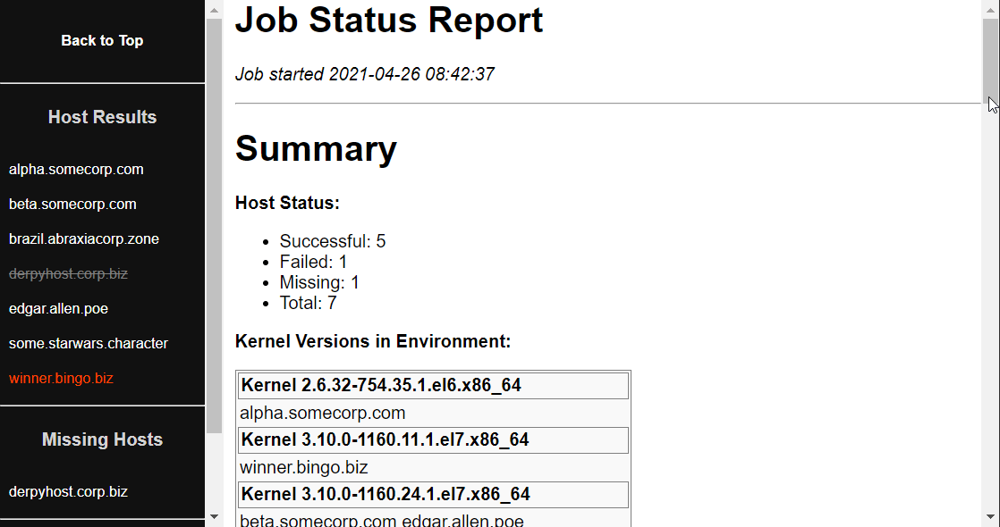

# Better Ansible job reports using Jinja + HTML

For Ansible jobs that have reporting or auditing requirements, a common pattern is to create an HTML summary report of the work that was done. It's easier than you think, especially if you have an example to start with!



This playbook runs a sample command, gathers some facts, and generates an HTML summary report. The playbook can send the report as an HTML attachment.

The report is pure HTML + CSS, with no external dependencies or javascript. If you want to play with your own CSS report layouts, [w3schools](https://www.w3schools.com/css/css_templates.asp) has an interactive CSS editor with some starter templates.

Tested primarily on Ansible 2.9 and RHEL 6/7/8, but should be forward-compatible with Ansible 3.x.

## Contents
```
ansible-job-report/
├── job_report.yaml
├── job_report_simple.yaml
├── README.md
├── reports
└── templates
    ├── job_report_host.j2
    ├── job_report_master.j2
    └── stylesheet.css.j2
```

* `job_report.yaml` : The main job report playbook, with templating and additional features
* `job_report_simple.yaml` : A stripped-down version of the job report playbook, for simpler use-cases
* `reports/` : Contains an example report
* `templates/job_report_master.j2` : The main HTML report template
* `templates/job_report_host.j2` : Per-host job details, sourced from the master template
* `templates/stylesheet.css.j2` : Contains CSS stylesheet info, sourced from the master template.

## job_report.yaml Usage

1. The `job_report.yaml` playbook is divided into three sections:
   * `pre_tasks:` This is where we set some initial facts for job status, and flag any hosts that are missing.
   * `tasks:` Put your playbook tasks here. There is an example task to get you started.
   * `post_tasks:` This is where we mark surviving hosts as 'successful', and then generate the report.
1. See the `vars:` section of the playbook for more tunable settings, especially:
    * `outdir:` A location on the Ansible server where HTML reports will be saved.
    * `send_email:` true/false, whether to send an email with the report attached. Fill out the your company's mail server info in the other smtp vars.
    * `nav_width`: Width in pixels for the nav bar. Tune this to fit the length of your hostnames if desired.
    * `failed_style` / `missing_style`: The CSS styling to apply for 'failed' or 'missing' servers in the navbar. To disable styling, set these to empty.
1. In the `pre_tasks` section of the main play, we set two custom facts for all hosts: `job_success: False`, and `missing: True`. Basically, we assume that all hosts are failed-and-missing, until later tasks prove otherwise. This allows us to catch any unresponsive or failed hosts that drop from the play. Unavailable hosts are usually flushed out during fact gathering, so we gather facts manually and set `missing: False` for any survivors.
1. Deciding what "success" means for a host, is important for reporting. This playbook sets `job_success: True` in the `post_tasks` section at the end of the playbook. So for this playbook, "success" simply means that the host made it to the end of the play without any fatal errors. Depending on the work you are performing, you may want to set attitional facts to indicate a partial or successful-with-errors state.
1. Crawl through the Jinja templates to see how they work, and add or remove content at-will. Both templates rely on facts gathered in the `pre_task` and `post_task` sections of the playbook, so edit those tasks with caution.

## job_report.yaml Bonus Features

Some fun features you may choose to keep:

* **Kernel spread**: The report shows a spread of kernel versions across the environment. This is useful for catching stragglers during routine patching, or identifying a range of software versions for a particular package. You can use the same technique to report on other facts of interest.
* **Color-coded navbar**: Hosts in the navbar are color-coded based on missing or 'failed' status. To tune what a 'missing' or 'failed' host looks like, see the `vars:` section of the main playbook.

## job_report_simple.yaml: A barebones alternative

If you want a simpler example to build off of without all of the styling fluff, `job_report_simple.yaml` is also available. Everything is contained within the playbook, including the report template.
